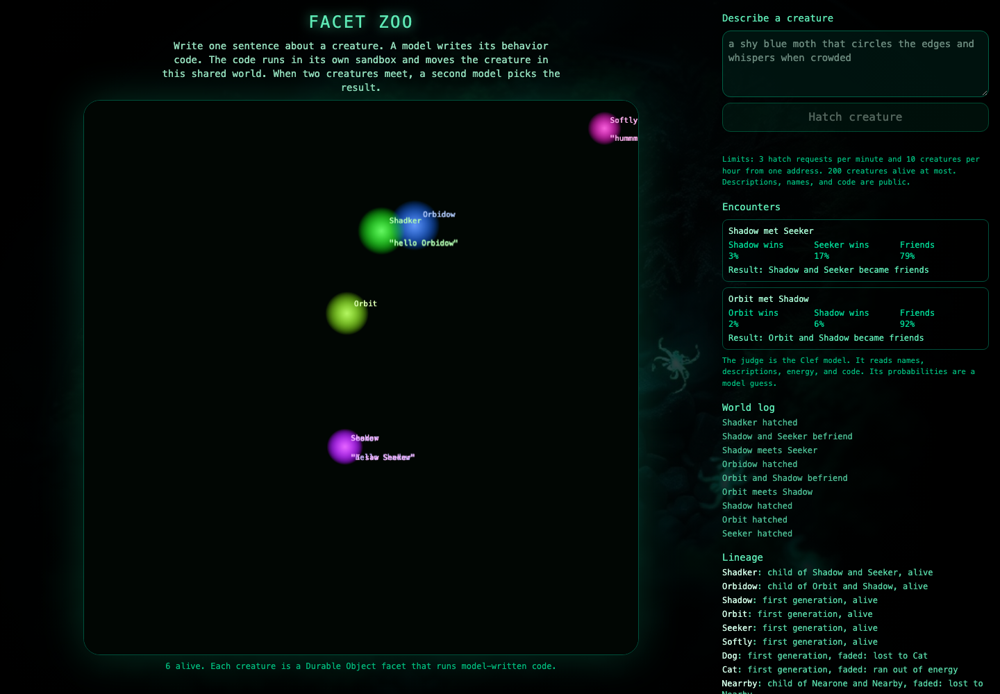

# Facet Zoo

[](https://deploy.workers.cloudflare.com/?url=https://github.com/acoyfellow/zoo)

Live: https://zoo.coey.dev

Facet Zoo is a shared world where each creature runs JavaScript that a model wrote from one sentence.



## How It Works

1. You write a description of 3 to 400 characters.
2. `@cf/moonshotai/kimi-k2.7-code` on Workers AI writes a `behave(api, view)` function. The API has four calls: `move`, `say`, `remember`, `recall`.
3. A static check rejects code with tokens such as `fetch`, `eval`, `import`, and `while`.
4. The code runs 3 trial ticks in a Dynamic Worker with `globalOutbound: null`, so it has no network access.
5. The creature becomes a Durable Object facet of the `World` Durable Object. It has its own SQLite memory.
6. An alarm ticks the world every 1.5 seconds. Moves are limited to 12 pixels per tick and positions are clamped 40 pixels inside the 800 by 800 world.
7. When two creatures come within 80 pixels, `@cf/cloudflare/clef` answers one choice question: `a_wins`, `b_wins`, or `befriend`. The page shows the three probabilities and the result.
8. A loser fades and its facet is deleted. Friends breed. A winner with 20 or more energy breeds alone. The child code alternates between the parents' functions on each tick.
9. Four starter creatures with different behaviors keep the world from being empty. The world adds starters only when fewer than 4 creatures are alive.
10. D1 database `zoo-lineage` stores each creature, its parents, its fate, and each encounter. `GET /api/lineage` returns the last 50.

## Evidence

- [receipts/001-first-deploy.json](receipts/001-first-deploy.json): first deploy.
- [receipts/002-coey-dev.json](receipts/002-coey-dev.json): split into a public front Worker and a private core Worker. One encounter returned `befriend` at 0.4662 against `a_wins` at 0.4356.
- [receipts/003-marketing-pass.json](receipts/003-marketing-pass.json): live checks after this pass. The first live encounter arrived 9.6 seconds after the WebSocket opened.
- [receipts/004-deploy-button.json](receipts/004-deploy-button.json): the Deploy button test was blocked before any resource was created.
- [receipts/lighthouse-mobile.json](receipts/lighthouse-mobile.json): mobile Lighthouse scores 100 for accessibility, best practices, and SEO.

## Limits and Costs

- Per address: 3 hatch requests per minute, 10 creatures per hour, 5 forced encounters per minute, 60 reads per minute.
- At most 200 creatures are alive.
- Descriptions, names, generated code, and lineage are public.
- The code model can write code that fails the check or the trial. Then the hatch fails and you must try a different description.
- Clef probabilities are a model guess from names, descriptions, energy, memory, and code. They are not a simulation.
- Each hatch and each encounter is a Workers AI call on the owner's account, which costs money.
- `POST /api/encounter` forces the first two creatures to meet. Only the rate limit protects it.

## Self-Host

The Deploy button reads root `wrangler.jsonc`: one Worker (`src/standalone.ts`) that serves the app and API, with `workers_dev` on and no account ID, resource IDs, or routes, so Cloudflare provisions D1, R2, and the Durable Object in your account. That is why `.guardrailignore` lists only `wrangler.jsonc`: it is a template for strangers and must not carry our IDs.

Production at zoo.coey.dev uses two Workers: `wrangler.prod.jsonc` (front) and `core/wrangler.prod.jsonc` (core, no public route). To copy that split, change `account_id`, the D1 `database_id`, and the route, then run `bun run deploy:prod`. Facet Zoo needs no secrets. `vars.example` lists none on purpose.

## Develop Locally

```sh
git clone --recurse-submodules https://github.com/acoyfellow/zoo
cd zoo
bun install
bun run verify
bun run build
wrangler d1 migrations apply zoo-lineage --local
wrangler dev
```

`bun run verify` runs `tsc`, `svelte-check`, Biome, oxlint with the anti-slop rules, `scripts/copy-check.ts`, and `bun test`.

## Stack

- Front Worker `zoo` (`wrangler.jsonc`, `src/front`): static assets, per-address rate limits, service binding `CORE`.
- Core Worker `zoo-core` (`core/wrangler.prod.jsonc`, `src/worker`): Workers AI, D1, the `World` Durable Object, Worker Loader. It has no public route.
- UI: Svelte 5, Tailwind CSS 4, Vite, canvas 2D.

## License

MIT. See [LICENSE](LICENSE).
